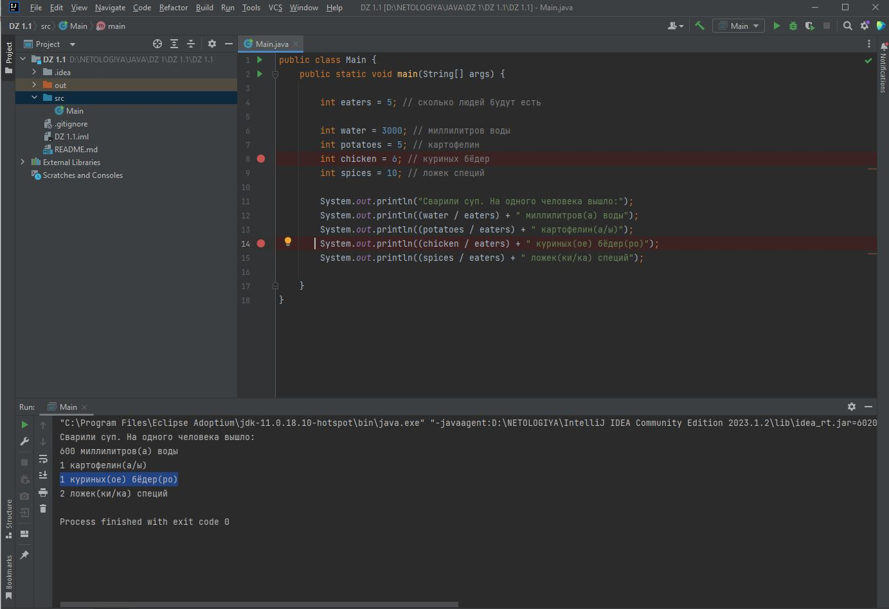

# Описание
Если при деление порции в результате значения есть остаток (нацело не делится), то на выходе программа выдает результат с окурглением 

# Локация дефекта

https://github.com/Axsobolev/DZ-1.1.1/blob/main/src/Main.java#L14

# Шаги воспроизведения

1. Открыть [код программы](https://github.com/Axsobolev/DZ-1.1.1/blob/main/src/Main.java) в IDEA
2. Запустить программу
3. Посмотреть на вывод консоли

*Ожидаемый результат:* 1,2 куриных(ое) бёдер(ро)

*Фактический результат:* 1 куриных(ое) бёдер(ро)

# Скриншот

# Окружение
* **Операционная система:** Windows 10 Pro 22H2
* **IDE:** IntelliJ IDEA Community Edition 2023.1.2
* **JAVA:** jdk-11.0.18.10